# LPortMan 操作マニュアル

LPortMan (Local Port Manager) は、ローカル開発で使うポートを調べて台帳にまとめ、
プロジェクト同士の衝突を見つけるツールです。

- 調べる対象のプロジェクトのファイルには**書き込みません** (読むだけ)
- LPortMan 自身はポートを使いません (デスクトップアプリ)
- 結果は `ports.json` に出力され、Claude などの AI エージェントもこれを参照できます

> 画面の画像 (`docs/images/`) は撮った人の環境のプロジェクト名・パスが写るため、リポジトリには入れていません。
> ソースから動かしている場合は `uv run python tools/manual_shots.py` で自分の環境の画面を撮って作れます
> (撮影中の 1 分ほどは、マウス・キーボードに触らないこと)。

---

## 目次

1. [起動](#1-起動)
2. [画面の共通部分](#2-画面の共通部分)
3. [タブごとの説明](#3-タブごとの説明)
4. [よくある作業](#4-よくある作業)
5. [Claude・CLI から使う](#5-claudecli-から使う)
6. [データファイル](#6-データファイル)
7. [用語](#7-用語)
8. [困ったとき](#8-困ったとき)

---

## 1. 起動

| 入れ方 | 起動 |
|---|---|
| exe (Releases の zip) | `lportmanw.exe` をダブルクリック |
| uv tool | `lportman-gui` |
| ソース | `LPortMan.bat` をダブルクリック (初回は `.venv` を作るので少し時間がかかる) |

起動するとすぐに調査 (スキャン) が始まり、1 秒ほどで一覧が表示されます。

**初回**は調べるフォルダが未設定なので、「調べるフォルダを選んでください」のダイアログが出ます。

- よくある開発用フォルダ (`C:\Repos`、`%USERPROFILE%\source\repos`、`Documents\GitHub` など) のうち、
  git リポジトリを含むものが候補としてチェック済みで並びます
- ほかのフォルダは「フォルダを追加...」で選べます。複数選べます
- 「開始」で保存してスキャンします。「あとで」を押した場合は [設定](#設定) タブから追加してください

---

## 2. 画面の共通部分

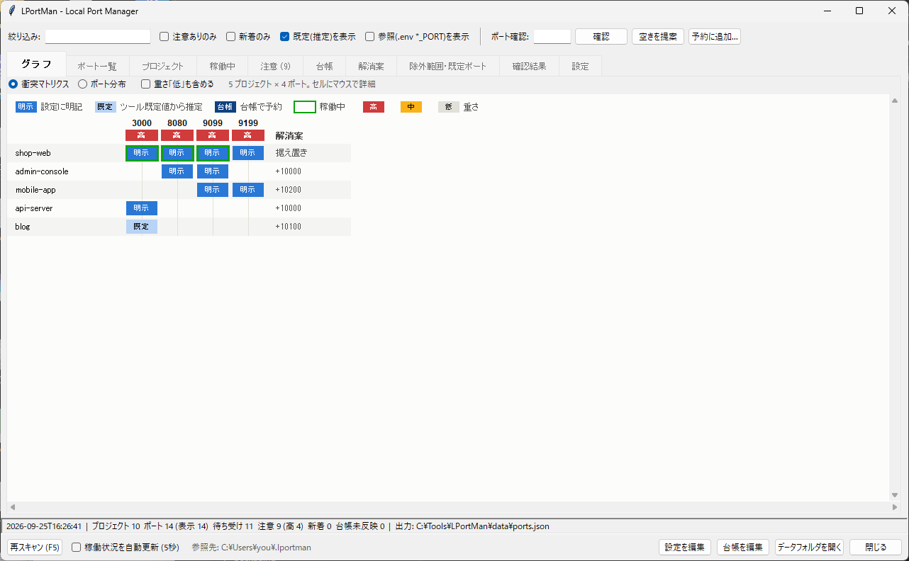

### 上部のツールバー

| 項目 | 働き |
|---|---|
| 絞り込み | ポート番号・プロジェクト名・サービス名などで一覧を絞る。全タブとグラフに効く |
| 注意ありのみ | 衝突などの注意があるポートだけを表示 |
| 新着のみ | 最近 (既定 7 日以内) 初めて見つかったポートだけを表示 |
| 既定(推定)を表示 | ツールの既定値から推定したポート (例: `vite` だけなら 5173) を表示する |
| 参照(.env *_PORT)を表示 | `.env` の `DB_PORT` など、接続先の可能性が高いものも表示する |
| ポート確認 / 確認 | 入力したポートを使ってよいか調べる ([確認結果](#確認結果) タブに出る) |
| 空きを提案 | 空いているポートの候補を出す。番号を入れると +10000 / +20000 を優先 |
| 予約に追加... | 台帳に予約を 1 件追加するダイアログを開く |

### 下部のフッター

| 項目 | 働き |
|---|---|
| 再スキャン (F5) | 設定ファイルを読み直して、全部を調べ直す |
| 稼働状況を自動更新 (5秒) | 待ち受け中のポートだけを 5 秒ごとに取り直す。設定ファイルは読み直さない |
| 参照先 | Claude が読む `%USERPROFILE%\.lportman` の状態 |
| 設定を編集 / 台帳を編集 | `config.json` / `registry.json` をエディタで開く (VS Code があれば VS Code)。保存すると自動で再スキャンする |
| データフォルダを開く | `data\` をエクスプローラーで開く |

ステータス行には、調べた時刻・件数・注意の数・新着の数・台帳の未反映の数が出ます。

### 色の意味 (一覧共通)

| 色 | 意味 |
|---|---|
| 赤い背景 | 注意「高」: 同時に起動できない衝突、Windows の除外範囲 |
| 黄色い背景 | 注意「中」、または台帳の未反映 |
| 青い背景 | 注意「低」: 既定値どうしの衝突など |
| 緑の文字 | いま待ち受け中 (稼働) |
| 灰色の文字 | 既定値からの推定・サンプル扱いのプロジェクト |
| 太字 | 新着 |

### 右クリック

ポート一覧・プロジェクト・稼働中・台帳の各一覧で行を右クリックすると、
その行に合わせたメニューが出ます。

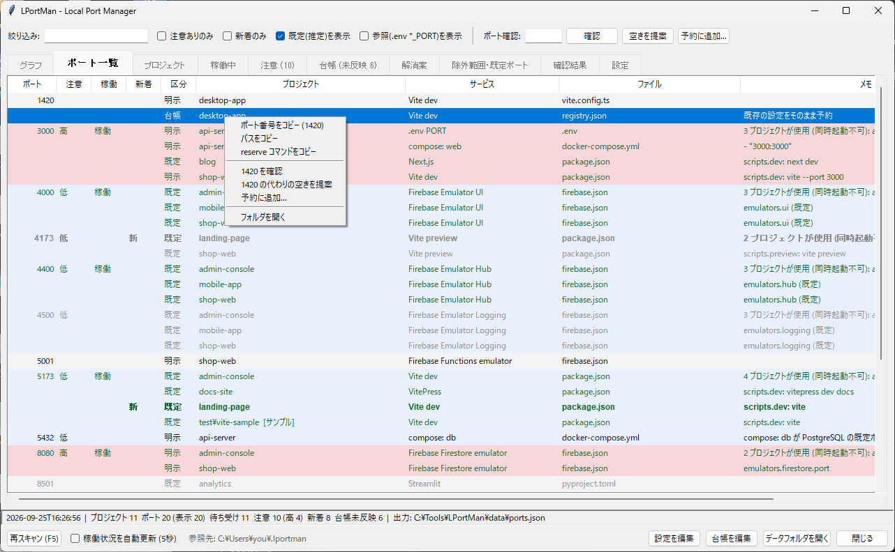

- ポート番号 / パス / `reserve` コマンドをコピー
- そのポートを確認 / 代わりの空きを提案 / 予約に追加
- フォルダを開く (行のダブルクリックでも開く)
- 稼働中タブでは「このプロセスを終了」も出る

---

## 3. タブごとの説明

### グラフ

**衝突マトリクス** (上の画像) : 行がプロジェクト、列が衝突しているポートです。
「どのプロジェクトとどのプロジェクトが、どのポートでぶつかっているか」を一目で見ます。

- セルの濃さ = 種別 (濃い青「明示」 / 薄い青「既定」 / 紺「台帳」)
- 列の見出しの色 = 衝突の重さ (高 / 中 / 低)
- 緑の枠 = いまそのポートで稼働中
- 右端 = [解消案](#解消案) のずらし幅
- セルにマウスを乗せると詳細、行の名前をダブルクリックでフォルダを開く
- 「重さ「低」も含める」で、既定値どうしの衝突も表示

**ポート分布** : 0〜65535 のどこにポートが集まっているかを見ます。

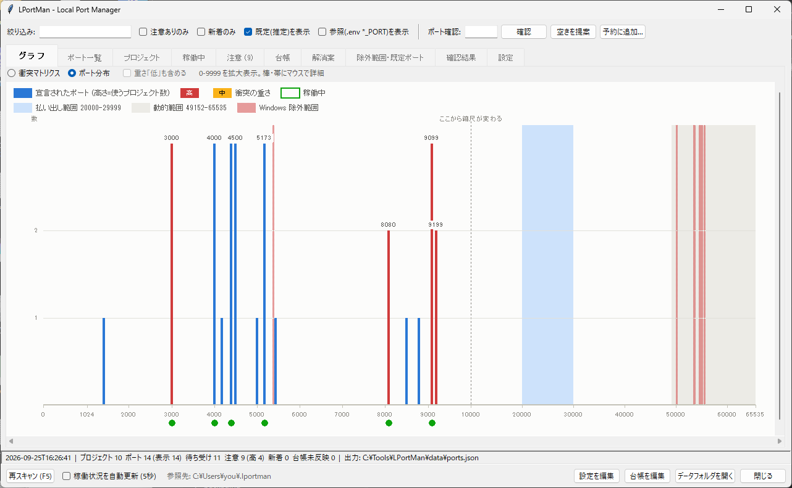

- 棒の高さ = そのポートを使うプロジェクトの数。赤は衝突「高」
- 薄い青の帯 = 払い出し範囲 (新しいポートはここから)
- 灰色の帯 = OS の動的範囲 (固定ポートには使わない)
- 網かけ = Windows の除外範囲 (使えない)
- 下の緑の点 = 稼働中
- 0〜9999 は拡大表示 (点線から右は縮尺が変わる)

### ポート一覧

ポート番号順に、そのポートを使うプロジェクトを並べます。

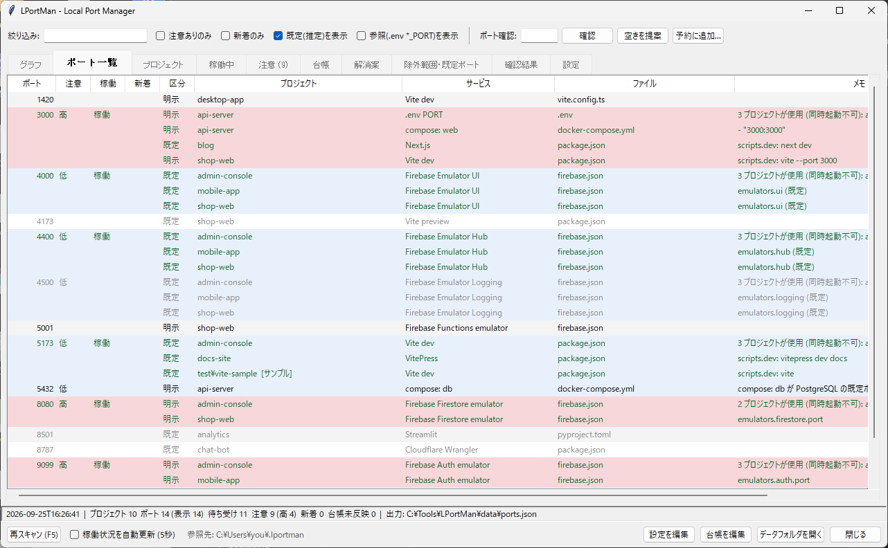

| 列 | 内容 |
|---|---|
| 注意 | 衝突の重さ (高 / 中 / 低) |
| 稼働 | いま待ち受け中なら「稼働」 |
| 新着 | 最近初めて見つかったものに「新」 |
| 区分 | 明示 / 既定 / 参照 / 台帳 ([用語](#7-用語)) |
| ファイル | ポートが書かれていたファイル (プロジェクトからの相対パス) |
| メモ | 1 行目は注意の内容、2 行目以降はファイル内の場所 |

### プロジェクト

プロジェクトごとに、使っているポートをまとめて見ます。

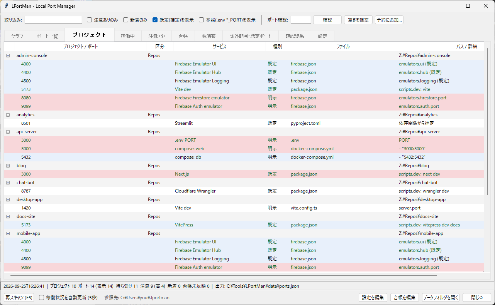

区分の列には、スキャンルートの名前、または「私的」「相談中」「サンプル」が出ます。

### 稼働中

いま待ち受けているポートと、そのプロセス・プロジェクトです。

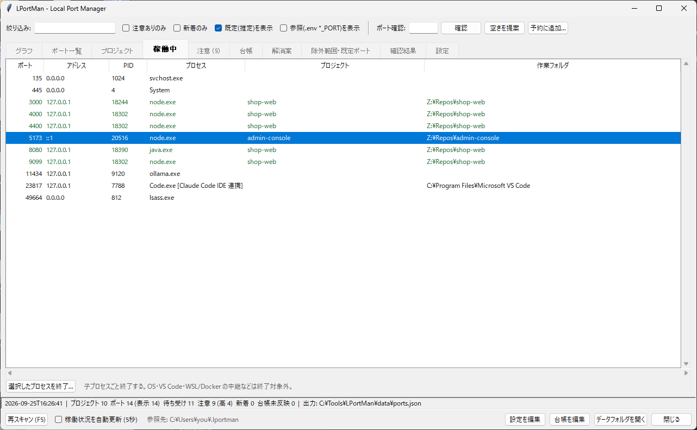

- 作業フォルダからプロジェクトを推定します
- WSL / Docker のコンテナは `wslrelay.exe` などの中継プロセスとして見えます。
  compose の設定から持ち主のプロジェクトを推定します
- `Code.exe [Claude Code IDE 連携]` は Claude Code 拡張のポートです。
  VS Code のウィンドウを開くたびに 10000〜65535 のどこかにランダムに作られます

**プロセスの終了** : 行を選んで「選択したプロセスを終了...」、または右クリックから。

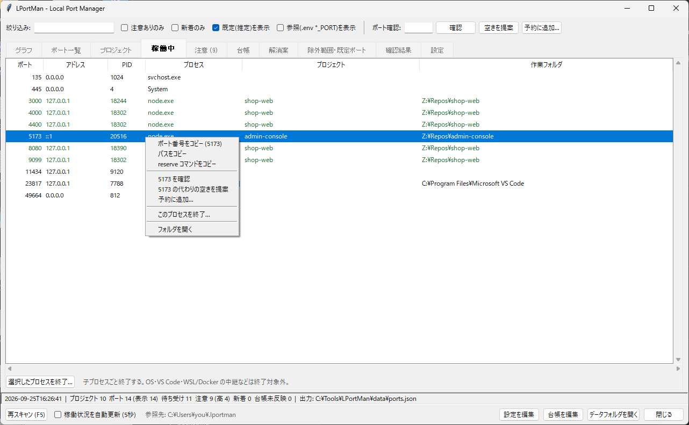

- コマンドラインを確認してから、子プロセスごと終了します
  (例: `npm run dev` の npm を選ぶと、下の node も止まる)
- OS・VS Code・WSL / Docker の中継などは終了できません

### 注意

注意の一覧です。重さの順に並びます。

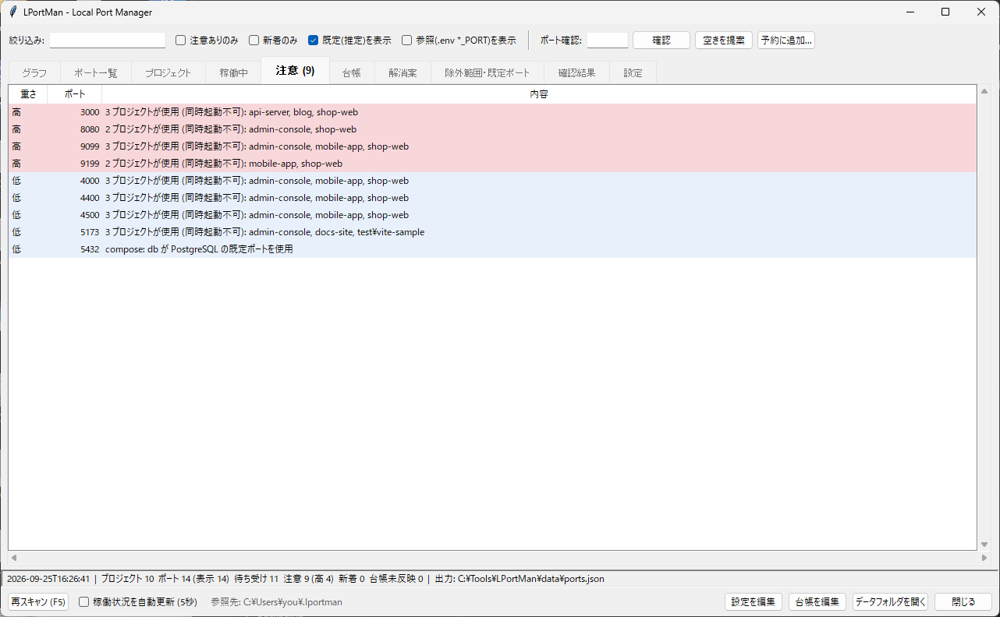

| 重さ | 例 |
|---|---|
| 高 | 明示どうしで複数プロジェクトが同じポート / Windows の除外範囲内 |
| 中 | 明示と既定の衝突 / 動的範囲内 / 宣言元以外のプロセスが使用中 |
| 低 | 既定どうしの衝突 / 別系統ツールの有名ポートを使用 |

「相談中」「サンプル」のプロジェクトしか関わらない衝突は、1 段軽く表示します。

### 台帳

手で決めた割り当て・予約の一覧です。ここに載せたポートは、ほかのプロジェクトからは
「使用不可」として扱われます。

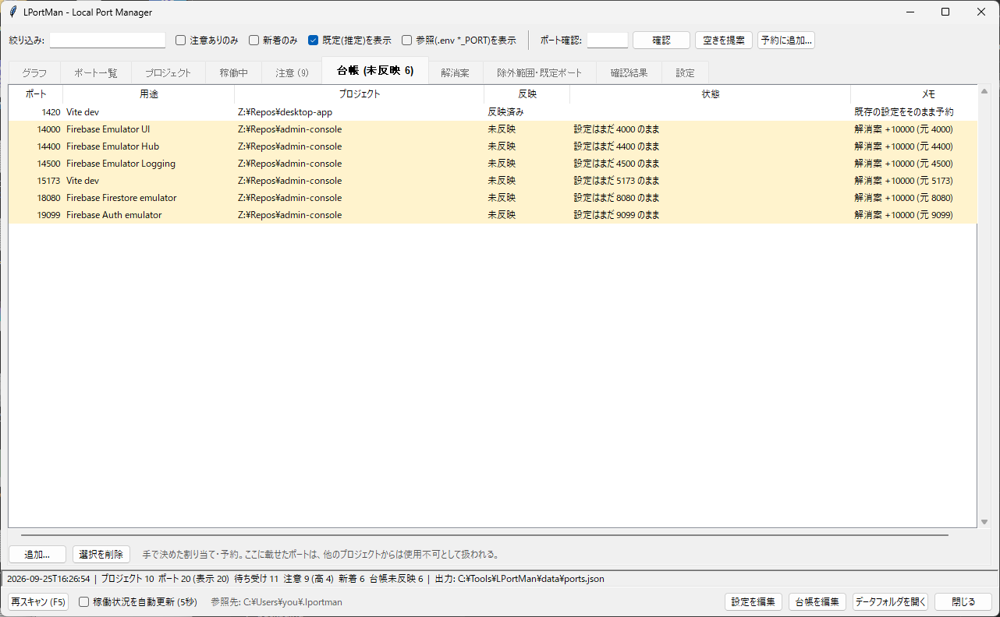

**反映** の列で、予約したポートがプロジェクトの設定に実際に書かれているかを追跡します。

| 反映 | 意味 |
|---|---|
| 反映済み | プロジェクトの設定にそのポートが書かれている |
| 未反映 | まだ書かれていない。旧ポートが残っていれば「設定はまだ 3000 のまま」と出る |
| 設定ファイルなし | フォルダはあるが、ポートを書いた設定ファイルが見つからない |
| フォルダなし | プロジェクトのフォルダが無い |

未反映の件数はタブ名 (「台帳 (未反映 9)」) にも出ます。

### 解消案

衝突を解消するための **提案** です。LPortMan はプロジェクトのファイルを変更しません。
共有プロジェクトは関係者と相談して決めてください。

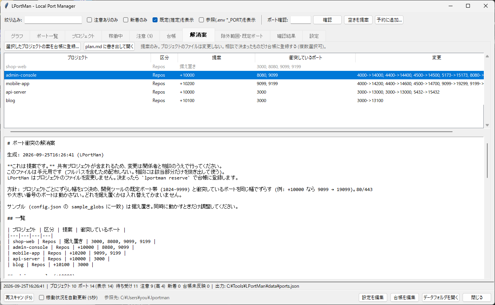

- 衝突しているプロジェクトごとに、ずらし幅を 1 つ決めます
  (+10000、埋まっていれば +10100、+10200 ...)
- ずらすのは 1024〜9999 のポートと、実際に衝突しているポートだけ。80/443 などは動かしません
- 据え置く (元のまま) 優先順: 稼働中 > 台帳で反映済み > 通常 > 私的 > 相談中 > サンプル
- 下半分は Markdown の本文。「plan.md に書き出して開く」でファイルにできます
  (フルパスを含むので手元用。人に渡すときは必要な部分だけ抜き出す)

一覧で行を選び (Ctrl / Shift で複数可)「選択したプロジェクトの案を台帳に登録...」を
押すと、その案のポートがまとめて台帳に入ります。登録したプロジェクトは
「予約済み (設定の変更待ち)」になり、台帳タブで未反映として追跡されます。

### 除外範囲・既定ポート

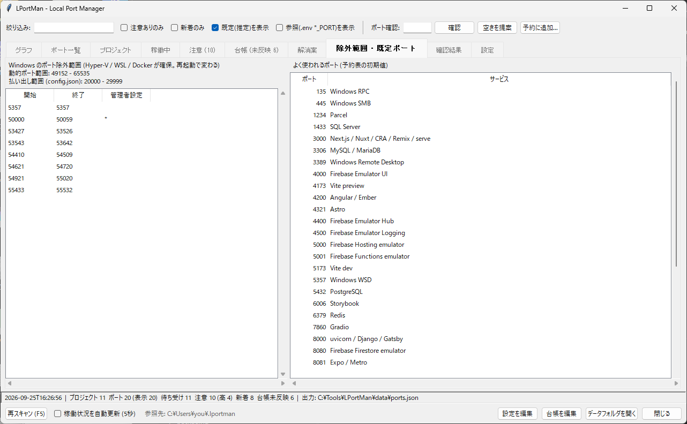

- 左: Windows のポート除外範囲。Hyper-V / WSL / Docker が確保するもので、**再起動で変わります**。
  この範囲のポートは空いて見えても使えません (bind が EACCES で失敗する)
- 右: よく使われるポートの一覧 (Firebase Emulator、Vite、Next.js、DB など)

### 確認結果

「ポート確認」「空きを提案」の結果が出ます。

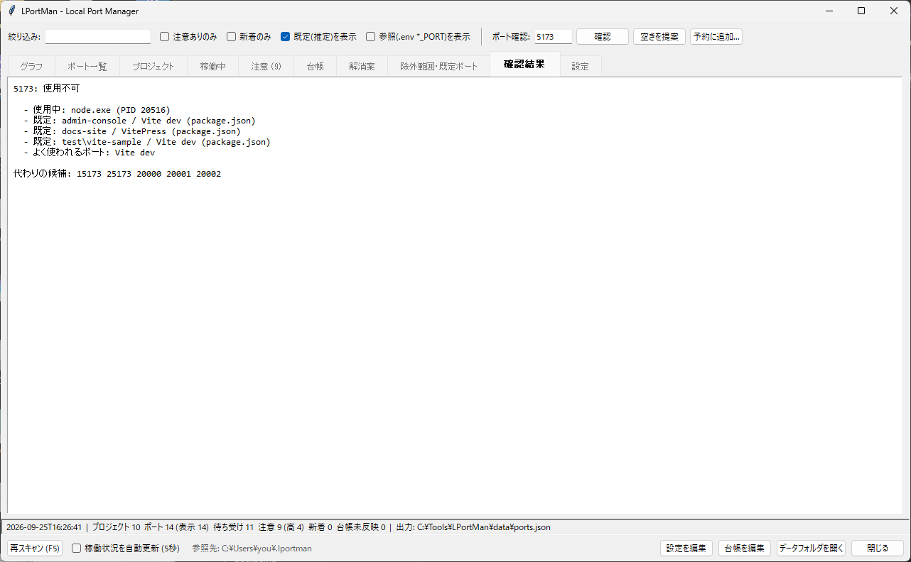

| 判定 | 意味 |
|---|---|
| 使用可 | どこにも使われていない |
| 注意 | 使えるが推奨しない (既定値で使われている、有名なポート、動的範囲など) |
| 使用不可 | 稼働中・明示で使用中・台帳で予約済み・除外範囲 |

使用可以外のときは、代わりの候補も出ます。

### 設定

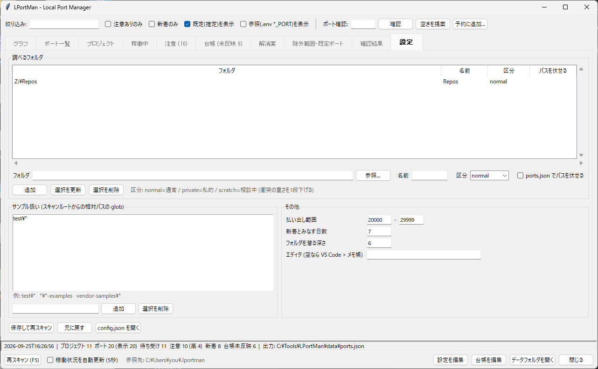

| 項目 | 内容 |
|---|---|
| 調べるフォルダ | スキャンするルート。区分 normal (通常) / private (私的) / scratch (相談中) |
| ports.json でパスを伏せる | Claude 向けの ports.json でフルパスを `<名前>\相対パス` にする |
| サンプル扱い | 当てはまるプロジェクトは衝突を 1 段軽くし、解消案では据え置き。例 `test\*` |
| 払い出し範囲 | 「空きを提案」が探す範囲 (既定 20000-29999) |
| 新着とみなす日数 | この日数以内に初めて見つかったものを新着にする |
| フォルダを潜る深さ | スキャンルートから何階層まで調べるか |
| エディタ | 「設定を編集」「台帳を編集」で使う実行ファイル。空なら VS Code > メモ帳 |

「保存して再スキャン」で反映します。

---

## 4. よくある作業

### 新しいプロジェクトのポートを決める

1. 上部の「ポート確認」に、そのツールの既定ポートを入れる (Vite なら `5173`)
2. 「空きを提案」を押す → `15173 25173 ...` のように候補が出る
3. 「予約に追加...」を押し、候補を入れて登録する

   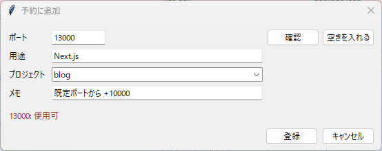

   - プロジェクトを選んでおくと、そのプロジェクト自身の宣言は障害として数えません
   - 「空きを入れる」で候補を自動で入れられます
4. プロジェクトの設定 (package.json の `--port`、vite.config の `server.port`、
   firebase.json の `emulators.*.port` など) に、そのポートを書く
5. 台帳タブの「反映」が「反映済み」になれば完了

Firebase Emulator は hub / logging / ui も含めて全ポートを firebase.json に書いてください。
書かないと 4400 / 4500 / 4000 でほかのプロジェクトと衝突します。

### 既存の衝突を解消する

1. [グラフ](#グラフ) の衝突マトリクスで、どこがぶつかっているかを見る
2. [解消案](#解消案) で提案を見る。共有プロジェクトは関係者と相談する
3. 合意したプロジェクトを選んで「選択したプロジェクトの案を台帳に登録...」
4. 各プロジェクトの設定ファイルを変更する (変更箇所は解消案の本文に書いてある)
5. [台帳](#台帳) で未反映が 0 になるまで追う

### ポートが空かない (前に起動したサーバが残っている)

1. [稼働中](#稼働中) タブで、そのポートの行を探す (絞り込みにポート番号を入れると速い)
2. プロセスとコマンドラインを確かめて「選択したプロセスを終了...」

### 最近増えたポートを見る

ツールバーの「新着のみ」をオンにします。

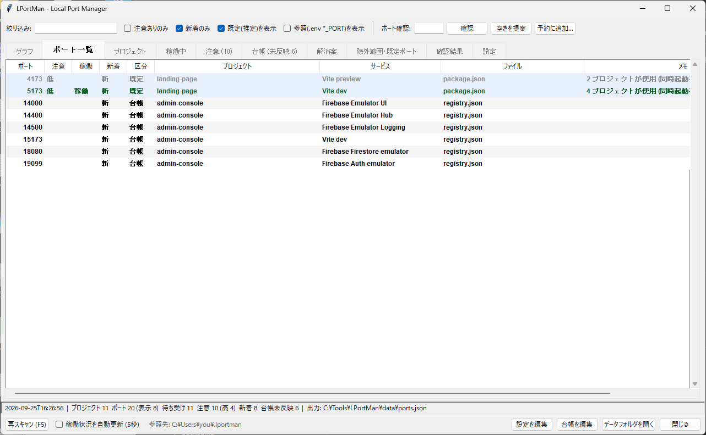

Claude や自分が新しいプロジェクトを作って既定の 5173 / 3000 のまま使い始めた、
といったことに気づけます。

---

## 5. Claude・CLI から使う

AI エージェント (Claude Code など) には、`CLAUDE.md` などで「ポートを決める前に LPortMan を
確認する」よう書いておくと効きます (文面の例は [README](../README.md#claude-code-などと組み合わせる))。
エージェントは `%USERPROFILE%\.lportman\ports.json` を読み、CLI を呼びます。
`ports.json` の `about` に、その環境で CLI を呼ぶコマンドが書かれています。

| 入れ方 | CLI の呼び方 |
|---|---|
| exe | `<展開したフォルダ>\lportman.exe <コマンド>` |
| uv tool | `lportman <コマンド>` |
| ソース | `uv run --project <リポジトリ> lportman <コマンド>` |

| コマンド | 働き |
|---|---|
| `scan` | 調査して ports.json を更新 |
| `list [--conflicts] [--json]` | ポート一覧 / 注意のみ |
| `check <port>...` | 使ってよいか (使用不可があれば終了コード 1) |
| `suggest [既定ポート] [-n 件数]` | 空きの候補。既定ポートを渡すと +10000 / +20000 を優先 |
| `reserve <port> --name 用途 [--project フォルダ] [--note メモ]` | 台帳に予約 (使用不可なら拒否。`--force` で強行) |
| `unreserve <port> --name 用途` | 台帳から削除 |
| `plan [--out ファイル]` | 解消案を Markdown で出力 (既定 `data\plan.md`、`-` で画面に出す) |
| `link` | `%USERPROFILE%\.lportman` → `data\` のジャンクションを作る |
| `gui` | 画面を開く |

---

## 6. データファイル

exe なら exe の隣の `data\`、ソースならリポジトリ直下の `data\` (git 管理外)、
`uv tool install` なら `%LOCALAPPDATA%\LPortMan` にあります。
`%USERPROFILE%\.lportman` はこのフォルダへのディレクトリジャンクションです。

| ファイル | 内容 | 編集 |
|---|---|---|
| `config.json` | 設定 ([設定](#設定) タブと同じ内容) | 画面または手で |
| `registry.json` | 台帳 (予約) | 画面または手で |
| `ports.json` | 調査結果。Claude が読む | 自動 |
| `seen.json` | ポートを初めて見つけた日時 (新着の判定用) | 自動 |
| `plan.md` | 解消案。フルパスを含むので手元用 | 自動 |

---

## 7. 用語

| 用語 | 意味 |
|---|---|
| 明示 | 設定ファイルに数値で書かれているポート |
| 既定 | ツールの既定値から推定したポート (設定を書けば変わる) |
| 参照 | `.env` の `DB_PORT` など `*_PORT`。接続先の可能性が高いので衝突判定に使わない |
| 台帳 | `registry.json` で予約したポート |
| 払い出し範囲 | 新しいポートを取る範囲 (既定 20000-29999) |
| 動的範囲 | OS が一時的に割り当てる範囲 (49152-65535)。固定ポートに使わない |
| 除外範囲 | Hyper-V / WSL / Docker が確保した範囲。使えない。再起動で変わる |
| 私的 / 相談中 / サンプル | プロジェクトの区分。相談中とサンプルは衝突の重さを 1 段下げる |

調べる設定ファイル: `package.json` の scripts、`vite.config.*`、`firebase.json`、
`docker-compose.yml` / `compose.yml`、`.env*` (例示用の `.env.example` などは除く)、`pyproject.toml`。

---

## 8. 困ったとき

| 症状 | 対処 |
|---|---|
| 「設定を編集」でブラウザが開く | [設定](#設定) タブのエディタに実行ファイルを指定する |
| プロジェクトが一覧に出ない | ポートを書いた設定ファイルが無いプロジェクトは出ない。深い階層なら「フォルダを潜る深さ」を増やす |
| 空いているはずのポートで起動に失敗する | [除外範囲](#除外範囲既定ポート) に入っていないか確認する (再起動で変わる) |
| 稼働中のプロジェクト欄が空 | 作業フォルダが取れないプロセス (別ユーザー・WSL 内) は推定できない |
| 参照先が「未作成」 | コマンド `lportman link` を実行する |
| 新着が多すぎる | 「新着とみなす日数」を短くする |
